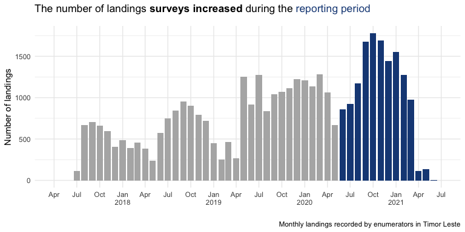
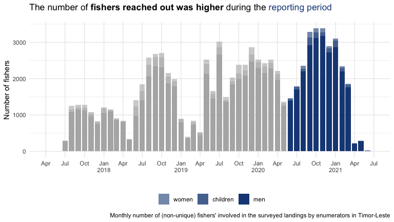

Minderoo reporting data
================

  - This report uses data of up to 2021-06-18 for the landing surveys
    and 2021-06-17 for the PDS tracking.

  - The reporting period in focus here is between 2020-06-01 and
    2021-06-18.

  - The Minderoo funding helped us increase the amount of data collected
    and hence the quality of our estimates. Enumerators have recorded 46
    985 landings so far, 21 102 of those during the reporting period.

  - The Minderoo funding also helped us increase the geographic spread
    of the data collection. We were able to survey up to 25 landing
    sites across East Timor during the reporting period.

  - The increase in surveys and geographical spread allowed us to
    capture the work of 39 118 (non-unique) artisanal fishers during the
    reporting period.

  - Using the PDS trackers, we have tracked a total of 420 boats. The
    number of tracked boats has decreased over the reporting period.
    Presumably mainly due to malfunction or physical damage.

  - The trackers have recorded a total of 76 324 trips, 23 189 of them
    during the reporting period. A smaller number than in previous
    periods.

  - Despite the smaller number of trips the effort of each fishing trip
    has been relatively stable.

<!-- -->

<!-- -->

<!-- -->

<!-- -->

<!-- -->

<!-- -->

<!-- -->

<!-- -->

<!-- -->
