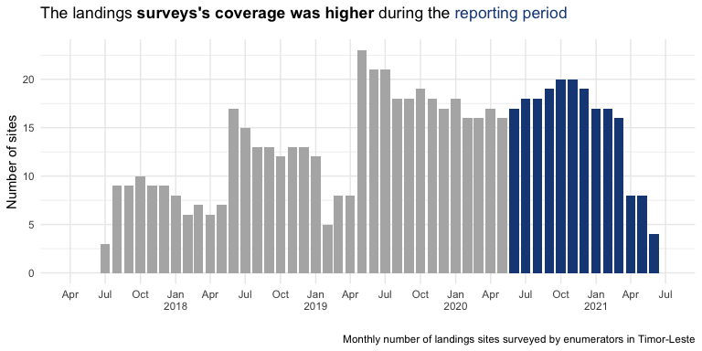
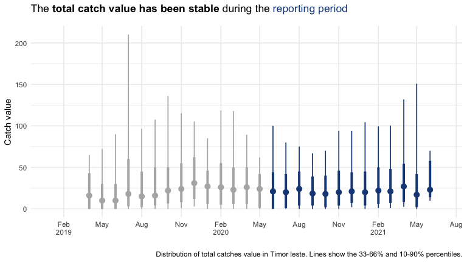
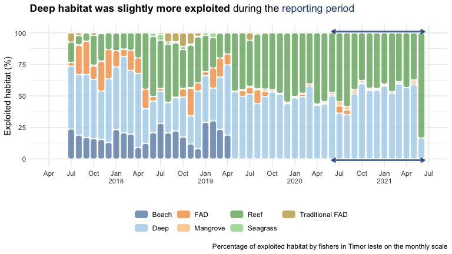

Minderoo reporting data
================

  - This report uses data of up to 2021-06-04 for the landing surveys
    and 2021-06-13 for the vessel tracking (Pelagic Data Systems).

  - The reporting period in focus here is between 2020-06-01 and
    2021-06-13.

  - The Minderoo funding helped us to continue and increase the amount
    of data collected and hence the quality of our estimates.
    Enumerators have recorded 39 718 landings so far, 13 581 of those
    during the reporting period.

  - The Minderoo funding also helped us to increase the geographic
    spread of the data collection. We were able to survey up to 20
    landing sites across Timor-Leste during the reporting period.

  - The increase in surveys and geographical spread allowed us to
    capture the work of 26 378 (non-unique) small-scale fishers during
    the reporting period.

  - Using the vessel trackers, we have tracked a total of 420 boats. The
    number of tracked boats has decreased over the reporting period.
    Presumably mainly due to deterioration, malfunction or physical
    damage to the devices.

  - The trackers have recorded a total of 76 165 trips, 23 030 of them
    during the reporting period. A smaller number than in previous
    periods of similar length.

  - Despite the smaller number of trips the effort of each fishing trip
    has remained relatively stable.

<!-- -->

<!-- -->

<!-- -->

<!-- -->

<!-- -->

<!-- -->

<!-- -->

<!-- -->

<!-- -->

<!-- -->
